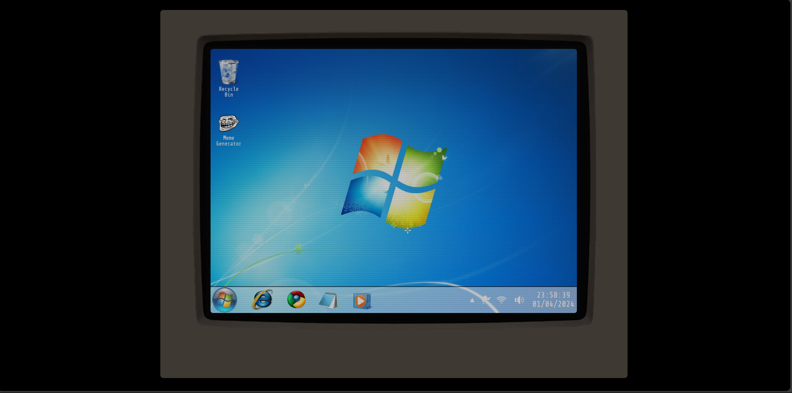

# Monitor_Portfolio_V1
A simple and elegant computer monitor interface made using CSS, serving as a gateway to explore my portfolio of completed projects.
When the user clicks in one icon of a project displayed, it will be redirected to the corresponding project page for further exploration.

# Home:

